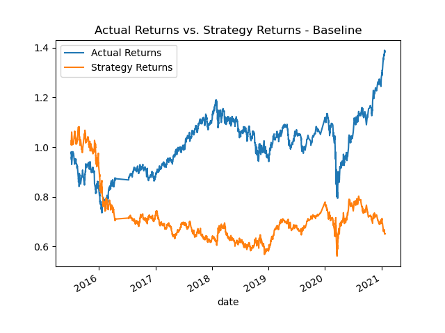
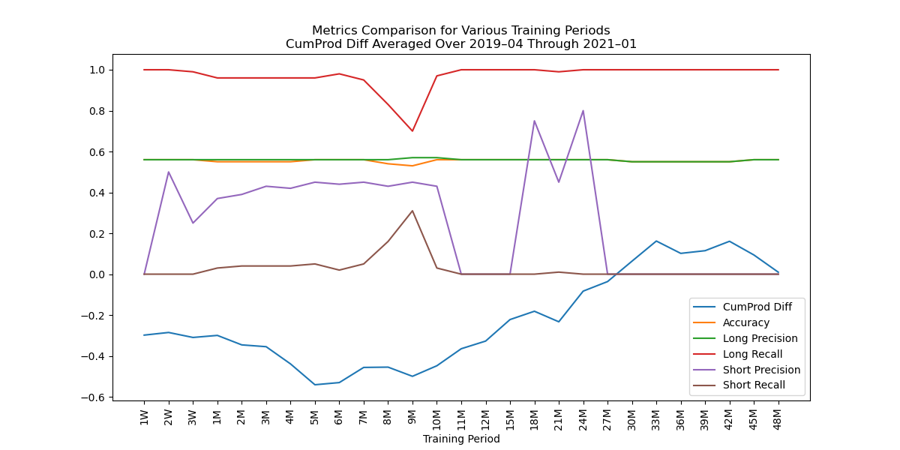
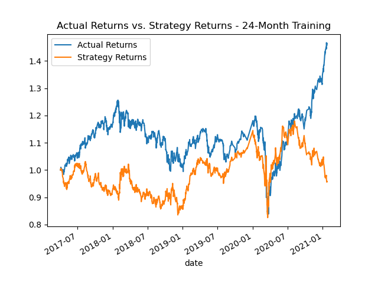
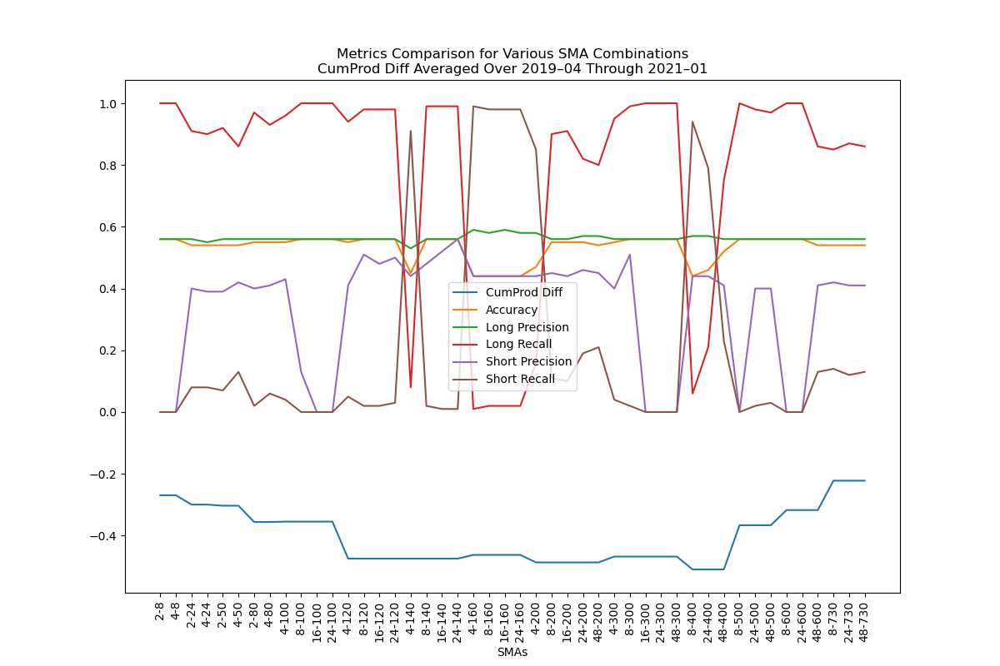
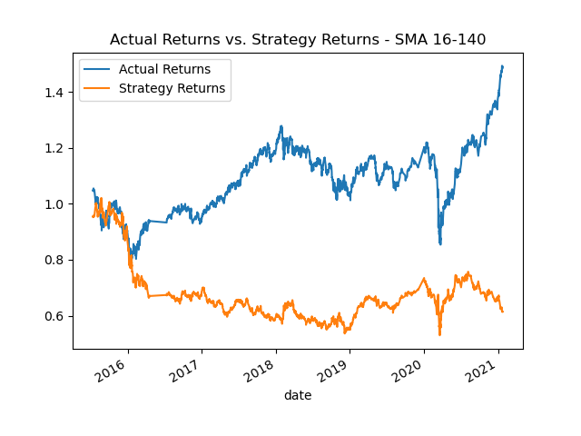
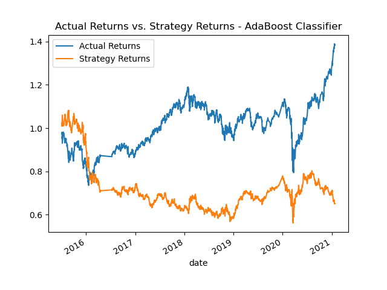
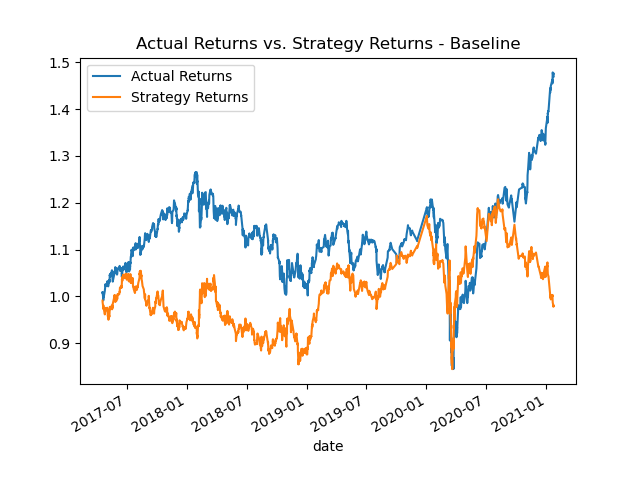
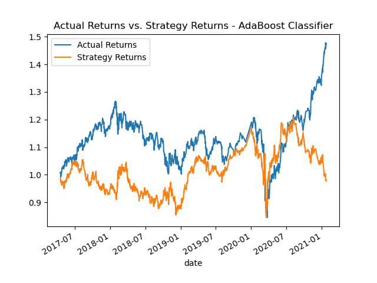

# algorithmic-trading-homework
Module 14 Challenge: Machine Learning Trading Bot

## Establish a Baseline Performance
The SVC model, providing our baseline performance, results in the following metrics:

|            | Accuracy | Long precision | Long recall | Short precision | Short recall |
|:---------- |:--------:|:--------------:|:-----------:|:---------------:|:------------:|
| **Result** | 0.55     | 0.56           | 0.96        | 0.43            | 0.04         |

With regard to cumulative products, in 2015, strategy returns exceeded actual returns. In early 2016, strategy returns deviated from actual returns, underperforming until 2018. From 2018 until mid-2020, strategy returns matched actual returns, but then deviated again. Overall, strategy returns have greatly underperformed compared to actual returns.

## Tune the Baseline Trading Algorithm

### Question:
### What impact resulted from increasing or decreasing the training window?

**Answer:**

With regard to the average difference between the cumulative product of strategy returns and the cumulative product of actual returns (CumProd Diff), decreasing the training window to as little as one week showed minor improvement over the baseline 3-month training window. While increasing the training window initially increased the difference, continuing to increase the training window from 9 months to 33 months showed steady reduction in the difference. After 33 months, further increasing of the training window showed a plateau, followed by another increase, in the difference.

Concerning the classification reports generated for the machine-learning models, accuracy and long precision remained rather constant across all training windows. While long recall and short recall also remained rather constant across all training windows&mdash;with the exception of a dip/spike over 8- and 9-month training windows&mdash;they were in opposition to each other. The only metric that showed any real fluctuation was that of short precision. For training windows under 11 months in length, short precision remained rather steady around 0.40. For training windows of 11 months and beyond, the precision flat-lined at 0, with the exception of a spike between 18 and 24 months.

Given the above analysis, a 24-month training window seems optimal. While the optimal difference in cumulative products was found at the 33-month training window, the model had predicted no short signals (`-1`), thereby forcing a short precision and short recall of 0.00. Providing our original SVC model with a 24-month training window results in the following metrics:

|            | Accuracy | Long precision | Long recall | Short precision | Short recall |
|:---------- |:--------:|:--------------:|:-----------:|:---------------:|:------------:|
| **Result** | 0.55     | 0.56           | 1.00        | 0.80            | 0.00         |

### Question:
### What impact resulted from increasing or decreasing either or both of the SMA windows?

**Answer:**

With regard to the average difference between the culumative product of strategy returns and the cumulative product of actual returns, neither increasing nor decreasing the short-window (fast) SMA, relative to the long-window (slow) SMA, had any effect on the cumulative product of strategy returns over the baseline 4-100 (fast-slow) SMA combination. Decreasing the slow SMA made for minor improvement in the difference. While increasing the slow SMA initially increased the difference, continuing to increase the slow SMA beyond 400 showed steady reduction of the difference.

Concerning the classification reports generated for the machine-learning models, accuracy and long precision remained rather constant across all SMA combinations, with the exception of a few dips in accuracy that aligned with dips in long recall. Long recall remained fairly steady above 0.080, though did witness a few extreme dips below 0.10. Short recall was always in opposition to long recall, spiking whenever long recall dipped. Short precision is the only metric that seemed to fluctuate somewhat independently. 

Given the above analysis, a fast-slow SMA combination of 16-140 seems optimal. While other SMA combinations provided more desirable differences in cumulative products, the 16-140 SMA combination provided better overall metrics. Providing our original SVC model with 16-140 SMA combination results in the following metrics:

|            | Accuracy | Long precision | Long recall | Short precision | Short recall |
|:---------- |:--------:|:--------------:|:-----------:|:---------------:|:------------:|
| **Result** | 0.56     | 0.56           | 0.99        | 0.52            | 0.01         |

### Conclusion

Using a training period of 24 months and SMA windows of 16 (fast) and 140 (slow), the cumulative product of strategy returns closely matches the cumulative product of actual returns. Strategy returns initially deviate during the latter half of 2017, then begin to out-perform actual returns from mid-2019 through mid-2020. In the latter half of 2020, strategy returns deviate once again. While the above plot appears to show an improvement in strategy returns over the baseline model, bear in mind that, due to the longer training window, the plot reflects a smaller window of returns. Metrics from the classification report should be taken into account for a proper analysis. (See the [Summary Evaluation Report](https://github.com/julianritchey/algorithmic-trading-homework#summary-evaluation-report) for a more thorough analysis)

The classification report for the tuned model provides the following metrics:

|            | Accuracy | Long precision | Long recall | Short precision | Short recall |
|:---------- |:--------:|:--------------:|:-----------:|:---------------:|:------------:|
| **Result** | 0.56     | 0.56           | 1.00        | 1.00            | 0.00         |

## Evaluate a New Machine Learning Classifier

### Conclusion

The new machine-learning classifier utilized was an AdaBoost classifier. The classification report for the model provides the following metrics:

|            | Accuracy | Long precision | Long recall | Short precision | Short recall |
|:---------- |:--------:|:--------------:|:-----------:|:---------------:|:------------:|
| **Result** | 0.55     | 0.56           | 0.92        | 0.44            | 0.08         |

### Question:
### Did this new model perform better or worse than the provided baseline model?
**Answer:**

The new model performed nearly identically to the provided baseline model. The cumulative product of strategy returns appears identical. Regarding metrics from the classification report, there were no changes in accuracy, long precision or cumulative product of strategy returns; short precision increased by 0.01 and short recall increased by 0.04, but long recall decreased by 0.04.

### Question:
### Did this new model perform better or worse than your tuned trading algorithm?
**Answer:**

Overall, the new model did not perform quite as well as the tuned trading algorithm. The plotted cumulative product of strategy returns appears to move identically, varying only in value, likely due to the shorer window of time. Regarding metrics from the classification report, long precision was identical, but there were decreases in accuracy of 0.01, long recall of 0.08 and short precision 0f 0.56; the only increase was short recall by 0.08.

## Summary Evaluation Report
The plots previously generated to display cumulative products of strategy returns against the cumulative product of actual returns depict differing windows of time. The plots, therefore, should not be used for the direct comparison of the models they represent. For proper comparison, the following plots have been generated using the same window of time.

In the above plots, it can be observed that there appears to be no difference in strategy returns between all three models. This may imply that, despite minor differences between the models, each model provided the same&mdash;or very similar&mdash;trade signals. For a better comparison of the models, the metrics from the classification reports should be analyzed.

| Model                   | Accuracy | Long precision | Long recall | Short precision | Short recall |
|:----------------------- |:--------:|:--------------:|:-----------:|:---------------:|:------------:|
| **Baseline**            | 0.55     | 0.56           | 0.96        | 0.43            | 0.04         |
| **Tuned**               | 0.56     | 0.56           | 1.00        | 1.00            | 0.00         |
| **AdaBoost classifier** | 0.55     | 0.56           | 0.92        | 0.44            | 0.08         |

The metrics from the classification reports provide clarity to the subtle differences between the models. Compared to the baseline model, the AdaBoost classifier (ABC) model performed nearly identically, though the tuned model appears to have performed better. While the ABC model out-performed the tuned model in short recall, the tuned model out-performed the ABC model in accuracy, long recall and short precision. All models scored the same for long precision.

Overall, the tuned model performed the best of the three models.

## Other information
- All work for the baseline model and AdaBoost classifier model can be found in the [machine_learning_trading_bot.ipynb](https://github.com/julianritchey/algorithmic-trading-homework/blob/main/machine_learning_trading_bot.ipynb) file.
- All work for the tuned model can be found in the [machine_learning_trading_bot_tuned_model.ipynb](https://github.com/julianritchey/algorithmic-trading-homework/blob/main/machine_learning_trading_bot_tuned_model.ipynb) file.
- All work relating to tuning of the baseline model can be found in the [metrics_calculations.ipynb](https://github.com/julianritchey/algorithmic-trading-homework/blob/main/metrics_calculations.ipynb) file.
- All data used and plots generated in this assignment can be found in the [Resources](https://github.com/julianritchey/algorithmic-trading-homework/tree/main/Resources) folder.